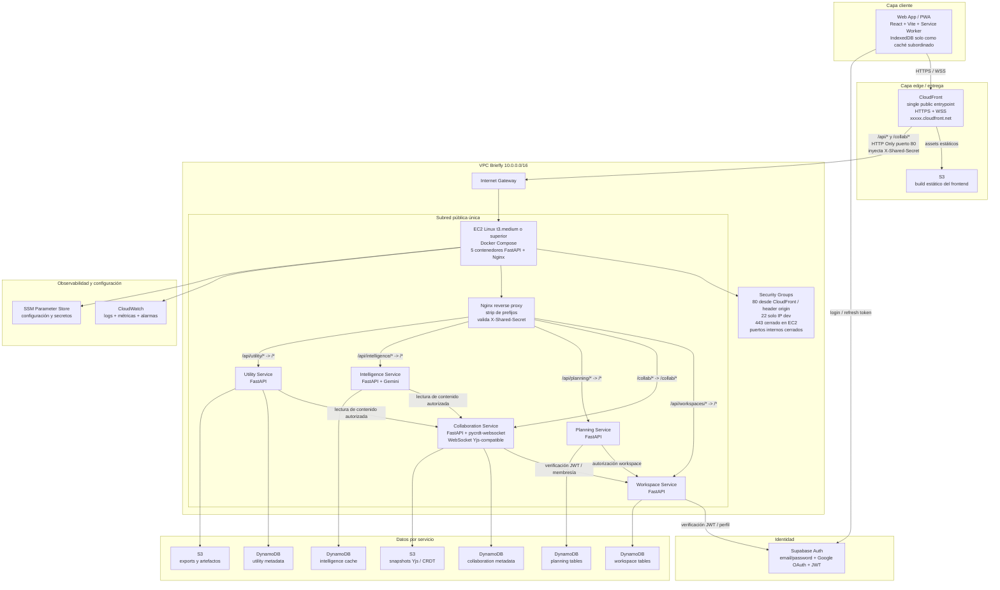

# Briefly — Arquitectura Cloud-First / Always-Online sobre AWS
**Versión:** 2.1  
**Fecha:** 2026-04-23  
**Ámbito:** entrega académica demostrativa, 3 usuarios simultáneos, ~2 horas continuas, presupuesto AWS Academy Learner Lab de 50 USD.

## Base de diseño cerrada

- El repositorio actual en `main` es el sistema original **P2P / local-first**.
- **No existe hoy** backend autoritativo, microservicios cloud-first desplegados ni runtime cloud funcional.
- Se parte **desde cero en cloud**.
- Se conservan únicamente estas piezas estratégicas:
  - Yjs + Tiptap en el frontend
  - `packages/shared` como paquete de contratos y tipos compartidos del cliente/contratos
  - parte del frontend UI reutilizable
  - servicios auxiliares ya concebidos: summary, stats, export, QR, link-preview
- Se eliminan del camino principal:
  - Electron
  - signaling local embebido
  - `ID@IP`
  - WebRTC peer-to-peer como mecanismo principal de sincronización
  - IndexedDB / localStorage como fuente de verdad
  - Hocuspocus como servidor colaborativo
  - Node.js/Fastify como stack de microservicios REST
- Mobile v1 queda cerrado como **PWA / navegador móvil**, no React Native.
- Todos los microservicios backend se implementan en **Python 3.12 + FastAPI**.
- El Collaboration Service se implementa en **Python 3.12 + FastAPI + pycrdt-websocket**, reemplazando a Hocuspocus.
- Supabase Auth se mantiene como proveedor de autenticación para v1.
- Para **Hackathon Mode / demo de 2 horas**, el host base se eleva a **EC2 t3.medium (4GB RAM) o superior** para absorber el footprint de Python/FastAPI, Docker Engine y Nginx sin depender del margen mínimo de `t3.small`.

---

## 1. Target Architecture — diagrama Mermaid + narrativa por capa



### 1.1 Decisión estructural central

La arquitectura objetivo **ya no es P2P con apoyo cloud**.  
La arquitectura objetivo es:

- **cloud-first**
- **always-online**
- con **nube autoritativa del dato**
- backend dentro de una **VPC**
- microservicios backend en **Python/FastAPI**
- y clientes web/PWA que consumen esa autoridad con caché local subordinado.

### 1.2 Invariantes arquitectónicos

1. **La nube manda.**  
   El dato autoritativo vive en los servicios cloud. El cliente nunca es soberano.

2. **Yjs se conserva, pero el peer-to-peer no.**  
   Yjs sigue siendo el modelo de colaboración del editor. La conectividad principal pasa a un **servidor WebSocket central en Python** usando `pycrdt-websocket`.

3. **Hocuspocus queda fuera.**  
   Hocuspocus era la decisión v1.2 porque era el camino más maduro del ecosistema Yjs en Node.js. La nueva restricción del profesor prohíbe Node.js en backend y exige reemplazarlo por Python. El reemplazo técnico aceptado es `pycrdt-websocket`.

4. **Todos los servicios backend son FastAPI.**  
   No habrá Node.js/Fastify para microservicios REST. La arquitectura hexagonal se implementa en Python.

5. **`packages/shared` se conserva, pero cambia de rol.**  
   Deja de ser el lugar donde vive lógica de escritura “soberana” del cliente y pasa a ser:
   - contratos DTO para el frontend
   - tipos TypeScript del cliente
   - constantes compartidas
   - errores y códigos de dominio
   - utilidades puras sin side effects

6. **Los 5 microservicios existen en runtime.**  
   No son carpetas simbólicas. Corren como contenedores separados dentro del mismo EC2.

7. **La VPC existe, pero no se usa NAT Gateway.**  
   El backend vive dentro de una VPC con subred pública e Internet Gateway. No se usa subred privada + NAT Gateway porque el costo fijo del NAT rompe el presupuesto de 50 USD.

### 1.3 Narrativa por capa

#### Capa cliente
La app principal será `apps/web`, una PWA React/Vite.  
El cliente:
- autentica contra Supabase Auth
- llama APIs REST por CloudFront
- abre WebSocket colaborativo por CloudFront
- usa IndexedDB solo como caché subordinado
- no promete edición offline soberana en v1

#### Capa edge
CloudFront es el único punto público de entrada:
- entrega frontend desde S3
- enruta `/api/*` hacia EC2
- enruta `/collab/*` hacia WebSocket del Collaboration Service
- termina TLS en el edge
- inyecta `X-Shared-Secret` hacia el origen EC2
- se usa la URL generada por CloudFront (`xxxxx.cloudfront.net`) sin Route 53 ni dominio propio

#### Capa red AWS
El backend está dentro de una VPC:
- CIDR sugerido: `10.0.0.0/16`
- una subred pública para el EC2
- Internet Gateway para tráfico desde/hacia internet
- Security Groups como frontera de puertos
- Nginx como reverse proxy interno y validador de `X-Shared-Secret`

#### Capa de cómputo
Un solo EC2 `t3.medium` o superior ejecuta Docker Compose:
- 5 contenedores FastAPI
- 1 contenedor Nginx
- límites de memoria asimétricos
- logs enviados a CloudWatch
- secretos/config desde SSM Parameter Store

#### Capa de datos
Cada microservicio tiene ownership exclusivo de sus tablas DynamoDB y/o buckets/prefijos S3:
- no hay RDS
- no hay 5 instancias de base de datos
- se cumple el requisito académico de BD propia mediante aislamiento de ownership

#### Capa de identidad
Supabase Auth sigue siendo el emisor de JWT:
- email/password
- Google OAuth
- refresh token
- JWT validado por servicios FastAPI

---

## 2. Los 5 microservicios — nombre, responsabilidad única, BD propia, endpoints principales, stack recomendado

### 2.1 Decisión de partición

Se mantienen **5 microservicios** porque el requisito académico lo exige, pero se evita fragmentar demasiado el dominio core.  
La regla es:

> Fragmentar por responsabilidad demostrable, no por entusiasmo arquitectónico.

### 2.2 Tabla de microservicios

| Microservicio | Responsabilidad única | BD propia / storage | Endpoints principales | Stack recomendado |
|---|---|---|---|---|
| **Workspace Service** | Workspaces, membresías, invitaciones, permisos base y perfil interno mínimo | DynamoDB: `briefly-workspaces`, `briefly-memberships`, `briefly-invites`, `briefly-profile-projections` | `GET /health`, `GET /me`, `GET /workspaces`, `POST /workspaces`, `GET /workspaces/{id}`, `POST /workspaces/{id}/members`, `POST /workspaces/{id}/invites` | Python 3.12 + FastAPI + boto3 + Pydantic v2 |
| **Collaboration Service** | Sincronización colaborativa Yjs-compatible, snapshots, checkpoints y presencia básica | DynamoDB: `briefly-collaboration-documents`, `briefly-collaboration-checkpoints`; S3: `briefly-doc-snapshots` | `GET /health`, `GET /documents/{id}/metadata`, `POST /documents/{id}/snapshot`, `WS /collab/{workspace_id}/{document_id}` | Python 3.12 + FastAPI + pycrdt-websocket + boto3 |
| **Planning Service** | Tareas, listas, calendario y horarios sin realtime obligatorio | DynamoDB: `briefly-task-lists`, `briefly-tasks`, `briefly-calendar-events`, `briefly-schedule-blocks` | `GET /health`, `GET /tasks`, `POST /tasks`, `PATCH /tasks/{id}`, `DELETE /tasks/{id}`, `GET /calendar`, `POST /calendar`, `GET /schedule`, `POST /schedule` | Python 3.12 + FastAPI + boto3 + Pydantic v2 |
| **Intelligence Service** | Resúmenes, estadísticas de texto, cache mínimo y control de llamadas a Gemini | DynamoDB: `briefly-intelligence-cache`, `briefly-intelligence-requests` | `GET /health`, `POST /summary`, `POST /stats`, `GET /requests/{id}` | Python 3.12 + FastAPI + google-generativeai + boto3 |
| **Utility Service** | Export, QR y link-preview detrás del backend | DynamoDB: `briefly-utility-jobs`, `briefly-link-previews`, `briefly-qr-records`; S3: `briefly-exports` | `GET /health`, `POST /exports`, `GET /exports/{id}`, `POST /qr`, `POST /link-preview` | Python 3.12 + FastAPI + boto3 + qrcode + httpx |

### 2.3 Cambio de stack respecto a v1.2

| Microservicio | Stack anterior v1.2 | Stack nuevo v2.1 |
|---|---|---|
| Workspace Service | Node 22 + Fastify + AWS SDK v3 + Zod | Python 3.12 + FastAPI + boto3 + Pydantic v2 |
| Collaboration Service | Node 22 + Hocuspocus + AWS SDK v3 | Python 3.12 + FastAPI + pycrdt-websocket + boto3 |
| Planning Service | Node 22 + Fastify + AWS SDK v3 + Zod | Python 3.12 + FastAPI + boto3 + Pydantic v2 |
| Intelligence Service | Node 22 + Fastify + Gemini SDK | Python 3.12 + FastAPI + google-generativeai + boto3 |
| Utility Service | Node 22 + Fastify + AWS SDK v3 | Python 3.12 + FastAPI + boto3 + qrcode + httpx |

### 2.4 Por qué esta agrupación

#### Workspace Service
Es el dueño del acceso.  
Si un usuario no tiene membresía en un workspace, ningún otro servicio debe permitirle operar sobre ese workspace.

#### Collaboration Service
Es el corazón del producto.  
Mantiene la edición colaborativa de documentos y reemplaza el modelo P2P local-first por un canal central WebSocket Yjs-compatible.

#### Planning Service
Saca tareas, calendario y horarios de Yjs.  
Para la demo no se necesita realtime completo en Planning. Basta REST + React Query + mutaciones optimistas.

#### Intelligence Service
Aísla IA y stats.  
Evita exponer API keys y timeouts de Gemini directamente al cliente.

#### Utility Service
Agrupa funcionalidades utilitarias que serían demasiado pequeñas como microservicios independientes:
- export
- QR
- link-preview

Esta agrupación es intencional. Cumple el requisito de 5 microservicios sin convertir la demo en una operación de 8–10 servicios.

### 2.5 Dependencias entre servicios

| Servicio origen | Servicio destino | Motivo |
|---|---|---|
| Collaboration | Workspace | validar membresía antes de abrir WebSocket |
| Planning | Workspace | validar permisos sobre workspace |
| Intelligence | Workspace / Collaboration | validar permiso y obtener contenido autorizado |
| Utility | Workspace / Collaboration | validar permiso y acceder a contenido/export |
| Todos | Supabase Auth | verificar JWT |
| Todos | CloudWatch / SSM | logs y configuración |

### 2.6 Regla de ownership de datos

Cada servicio:
- lee y escribe sus propias tablas
- no escribe tablas de otro servicio
- no accede directamente a secretos de otro servicio
- usa APIs internas cuando necesita validar ownership o permisos

---

## 3. Arquitectura hexagonal por microservicio — puertos, adaptadores, dominio aislado

### 3.0 Convención hexagonal en Python/FastAPI

La arquitectura hexagonal en Python se implementará con esta convención:

| Capa | Convención | Regla |
|---|---|---|
| Dominio | clases Python puras | sin FastAPI, boto3, HTTP, S3, DynamoDB ni SDKs externos |
| Puertos | `abc.ABC` o `typing.Protocol` | definen lo que el dominio necesita, no cómo se implementa |
| Casos de uso | clases de aplicación | orquestan puertos, validan flujo y ejecutan reglas |
| Adaptadores | implementaciones concretas | DynamoDB, S3, Supabase JWT, HTTP interno, Gemini, QR |
| Controladores | routers FastAPI | reciben request, validan DTOs Pydantic y llaman casos de uso |
| DTOs | Pydantic v2 | entrada/salida de API, nunca como sustituto del dominio |

Regla estricta:

> FastAPI y boto3 no entran al dominio. El dominio no debe saber que está en AWS.

### 3.1 Workspace Service

#### Puerto de entrada
- REST FastAPI

#### Dominio aislado
- Workspace
- Membership
- Invite
- Role
- ProfileProjection
- reglas mínimas de permisos

#### Puertos internos
- `WorkspaceRepository`
- `MembershipRepository`
- `InviteRepository`
- `ProfileProjectionRepository`
- `AuthTokenVerifier`

#### Adaptadores
- DynamoDB adapter
- Supabase JWT verifier
- internal HTTP client para health/diagnóstico si aplica
- CloudWatch logger

#### Casos de uso
- crear workspace
- listar workspaces por usuario
- validar membresía
- crear invitación
- aceptar invitación
- resolver permisos mínimos

#### Regla crítica
Workspace Service es la **fuente de autorización base** para todos los demás servicios.

---

### 3.2 Collaboration Service

#### Puerto de entrada
- WebSocket FastAPI/Starlette en `WS /collab/{workspace_id}/{document_id}`
- REST FastAPI para metadata, health y snapshots administrativos

#### Dominio aislado
- DocumentSession
- DocumentMetadata
- SnapshotPolicy
- Checkpoint
- PresenceSession
- CollaborationAccess

#### Puertos internos
- `DocumentSnapshotStore`
- `DocumentMetadataRepository`
- `CheckpointRepository`
- `WorkspacePermissionClient`
- `JwtVerifier`
- `Clock`

#### Adaptadores
- `pycrdt-websocket` adapter para protocolo Yjs-compatible
- S3 adapter para snapshots
- DynamoDB adapter para metadata/checkpoints
- Workspace Service HTTP client
- Supabase JWT verifier
- CloudWatch logger

#### Casos de uso
- abrir sesión colaborativa
- verificar JWT en handshake
- validar membresía contra Workspace Service
- cargar snapshot inicial desde S3
- sincronizar updates CRDT vía WebSocket
- aplicar debounce de flush
- persistir snapshot/checkpoint
- cerrar sesión con flush controlado

#### Decisión técnica crítica
Hocuspocus se reemplaza por `pycrdt-websocket`.

`pycrdt-websocket` se usa porque:
- `pycrdt` es el port oficial a Python de `y-crdt`, implementación Rust compatible con Yjs
- `pycrdt-websocket` implementa sincronización Yjs sobre WebSockets
- se integra con FastAPI/Starlette mediante WebSockets async
- permite cumplir la restricción de backend Python

#### Riesgo técnico
`pycrdt-websocket` es menos maduro que Hocuspocus:
- menor comunidad
- menos ejemplos de producción
- menos documentación operacional
- mayor probabilidad de bugs en reconexión o edge cases de sincronización

#### Mitigación obligatoria
Esta fase exige pruebas tempranas de:
- 2–3 usuarios simultáneos
- reconexión
- refresh de página
- pérdida temporal de red
- snapshot restore
- edición concurrente sobre el mismo documento

#### Advertencia operativa: Event Loop de FastAPI
El Collaboration Service corre sobre Python/FastAPI y WebSockets async.  
Aunque FastAPI maneja concurrencia de I/O correctamente, el event loop puede bloquearse si una operación CRDT pesada consume CPU durante demasiado tiempo.

Riesgo concreto:
- merges grandes de CRDT
- notas muy grandes pegadas de golpe
- snapshots pesados
- operaciones de serialización/deserialización intensivas

Medidas obligatorias para la demo:
- configurar timeouts generosos en Uvicorn para conexiones WebSocket
- limitar operativamente el tamaño de las notas durante la presentación
- evitar pegar bloques masivos de texto durante la demo
- probar reconexión con documentos pequeños y medianos, no solo con documentos vacíos
- tratar el Collaboration Service como el componente más sensible del sistema

Esta decisión no cambia el diseño.  
Solo reconoce que `pycrdt-websocket` en Python requiere disciplina operativa mayor que Hocuspocus.

#### Parámetro obligatorio de persistencia
El servicio debe exponer como configuración:
- `COLLAB_FLUSH_DEBOUNCE_SECONDS=30-60`

El debounce evita escribir snapshot en cada update y reduce carga sobre S3/DynamoDB.

---

### 3.3 Planning Service

#### Puerto de entrada
- REST FastAPI

#### Dominio aislado
- TaskList
- Task
- CalendarEvent
- ScheduleBlock
- PlanningPermission

#### Puertos internos
- `TaskRepository`
- `CalendarRepository`
- `ScheduleRepository`
- `WorkspacePermissionClient`
- `JwtVerifier`

#### Adaptadores
- DynamoDB adapter
- Workspace Service HTTP client
- Supabase JWT verifier
- CloudWatch logger

#### Casos de uso
- crear/listar task lists
- crear/editar/eliminar tareas
- crear/editar/eliminar eventos de calendario
- crear/editar/eliminar bloques de horario

#### Decisión de frontend asociada
Planning no usa Yjs reactivo en v1.  
El frontend debe usar:
- fetch-on-load
- React Query
- refetch al volver a foco
- mutaciones optimistas
- rollback visual si falla una mutación

#### Regla de demo
Realtime para tareas y horarios **no es requisito de la demo**.

---

### 3.4 Intelligence Service

#### Puerto de entrada
- REST FastAPI

#### Dominio aislado
- TextAnalysisRequest
- SummaryRequest
- StatsResult
- SummaryResult
- IntelligenceCacheEntry

#### Puertos internos
- `TextAnalyzer`
- `SummaryGenerator`
- `IntelligenceCacheRepository`
- `WorkspacePermissionClient`
- `DocumentReaderClient`
- `JwtVerifier`

#### Adaptadores
- Gemini adapter usando `google-generativeai`
- DynamoDB cache adapter
- Collaboration/Workspace HTTP clients
- Supabase JWT verifier
- CloudWatch logger

#### Casos de uso
- generar resumen
- calcular estadísticas
- cachear respuesta por hash de texto
- manejar timeout controlado
- devolver error seguro si Gemini falla

#### Timeout obligatorio
- CloudFront Origin Response Timeout: **60 segundos**
- timeout interno del Intelligence Service: **55 segundos**

Si Gemini no responde dentro de 55 segundos, el servicio debe devolver error controlado.

---

### 3.5 Utility Service

#### Puerto de entrada
- REST FastAPI

#### Dominio aislado
- ExportJob
- ExportFormat
- QRRequest
- LinkPreviewRequest
- UtilityArtifact

#### Puertos internos
- `ExportStore`
- `ExportJobRepository`
- `QrGenerator`
- `LinkPreviewFetcher`
- `WorkspacePermissionClient`
- `DocumentReaderClient`
- `JwtVerifier`

#### Adaptadores
- S3 adapter para exports
- DynamoDB adapter para metadata/jobs
- `qrcode` adapter
- `httpx` adapter para link-preview
- Collaboration/Workspace HTTP clients
- Supabase JWT verifier
- CloudWatch logger

#### Casos de uso
- crear export
- consultar export
- generar QR
- generar link-preview
- registrar artifact

#### Regla operativa
Utility tiene más memoria que servicios REST simples porque exportaciones y buffers binarios pueden generar picos.

---

### 3.6 Regla transversal de hexagonalidad

Prohibido:
- poner llamadas a DynamoDB dentro de routers FastAPI
- poner lógica de permisos dentro de adaptadores
- llamar Supabase directamente desde casos de uso sin puerto
- compartir modelos ORM inexistentes entre servicios
- leer tablas de otro servicio desde un adapter local
- mezclar DTOs Pydantic con entidades de dominio

Permitido:
- DTOs Pydantic en controladores
- puertos definidos con ABC/Protocols
- adapters concretos por servicio
- contratos TypeScript compartidos para frontend
- contratos OpenAPI generados por cada FastAPI

---

## 4. Decisiones de infraestructura AWS — qué servicio de AWS para qué, con justificación de costo

### 4.1 Servicios AWS elegidos

| Servicio | Uso | Justificación |
|---|---|---|
| **VPC** | red del backend | requisito explícito del profesor; permite demostrar frontera de red y Security Groups sin costo adicional |
| **Internet Gateway** | salida/entrada internet de subred pública | gratis; permite que CloudFront llegue al EC2 y que EC2 salga a Supabase/Gemini/AWS APIs |
| **Subred pública única** | ubicación del EC2 | cumple “backend dentro de VPC” sin NAT Gateway |
| **Security Groups** | control de puertos | frontera principal de red para puerto 80/22 y bloqueo de puertos internos |
| **EC2 t3.medium o superior** | host único de Docker Compose | 4GB RAM base para Hackathon Mode; reduce riesgo de OOM con 5 servicios Python/FastAPI + Docker + Nginx |
| **Docker Compose** | runtime de 5 servicios + Nginx | simple, auditable, barato, suficiente para 3 usuarios/2 horas |
| **Nginx** | reverse proxy interno | ruteo por paths, strip de prefijos, validación de header `X-Shared-Secret` |
| **CloudFront** | único punto público HTTPS/WSS | entrega frontend, proxy a APIs y WebSocket, TLS gratis en dominio cloudfront.net, inyección de header secreto al origen |
| **S3** | frontend build, snapshots Yjs, exports | storage barato, simple e integrado |
| **DynamoDB On-Demand** | BD propia por microservicio | costo casi cero en demo, sin administrar servidores, ownership por tabla |
| **CloudWatch** | logs y métricas | mínimo viable de observabilidad |
| **SSM Parameter Store** | configuración y secretos | evita `.env` sensibles hardcodeados |
| **Supabase Auth** | proveedor externo de identidad | ya aprobado; reduce riesgo; mantiene email/password, Google OAuth y JWT |

### 4.2 Diseño VPC aprobado

#### Topología

- VPC: `10.0.0.0/16`
- Subred pública única: por ejemplo `10.0.1.0/24`
- EC2 dentro de esa subred pública
- Internet Gateway asociado a la VPC
- route table pública con salida `0.0.0.0/0 -> Internet Gateway`
- CloudFront como único endpoint recomendado para usuarios
- sin subred privada
- sin NAT Gateway

#### Security Groups

| Puerto | Estado | Regla |
|---|---|---|
| 80 | abierto controlado | tráfico HTTP hacia Nginx; se acepta solo si CloudFront inyecta `X-Shared-Secret` válido |
| 443 | cerrado en EC2 | TLS termina en CloudFront, no en EC2 |
| 22 | restringido | solo IP del desarrollador |
| puertos internos | cerrados externamente | accesibles solo dentro de Docker network / localhost |

#### Nota técnica sobre “solo desde CloudFront”
Un Security Group no valida headers HTTP.  
La protección se implementa como defensa combinada:

- CloudFront inyecta un **Custom Origin Header**, por ejemplo `X-Shared-Secret`
- el valor del header se guarda como secreto en SSM Parameter Store / entorno seguro de Nginx
- Nginx rechaza toda petición que no contenga ese header o que lo tenga con valor incorrecto
- si el entorno permite usar CloudFront managed prefix list en Security Group, se aplica como control adicional
- si no, el header secreto en Nginx es el control práctico de demo

Justificación:
- evita que alguien llame directamente a la IP pública del EC2 y salte CloudFront
- mantiene CloudFront como punto de entrada lógico y operativo
- no requiere ALB, WAF ni infraestructura adicional
- es suficiente para una demo académica de 2 horas

Regla operativa:
> Nadie del equipo debe compartir ni usar la IP pública del EC2 como URL de prueba. La URL oficial de demo es siempre CloudFront.

### 4.3 Por qué no se usa NAT Gateway

No se usa subred privada + NAT Gateway porque:

- NAT Gateway cuesta aproximadamente `0.045 USD/hora`
- eso equivale a aproximadamente `32.40 USD/mes` solo por existir
- con presupuesto total de 50 USD, consume más de la mitad del margen
- la demo es de 3 usuarios durante ~2 horas
- una subred pública con Security Groups correctos, Nginx validando `X-Shared-Secret` y CloudFront como entrada oficial es suficiente para esta entrega académica
- el EC2 sigue estando **dentro de una VPC**, cumpliendo el requisito del profesor

Decisión:

> VPC sí. NAT Gateway no.

### 4.4 URL sin costo adicional

No se compra dominio.  
No se usa Route 53 con dominio propio.  
La demo usa:

```text
https://xxxxx.cloudfront.net
```

Justificación:
- CloudFront provee HTTPS sobre su dominio por defecto
- es accesible desde cualquier navegador
- no requiere comprar dominio
- no requiere zona hospedada Route 53
- reduce fricción de entrega

Opción no obligatoria:
- si alguien del equipo ya posee un dominio externo, puede crear un CNAME hacia CloudFront
- eso no es requisito de la arquitectura v2.1
- no debe bloquear la demo

### 4.5 Servicios AWS descartados explícitamente

| Servicio | Razón de descarte |
|---|---|
| **NAT Gateway** | costo fijo aproximado de 32.40 USD/mes; rompe margen del Learner Lab |
| **ECS/Fargate** | más limpio operativamente, pero multiplica complejidad, networking y costos relativos |
| **App Runner** | no es necesario y reduce control sobre WebSockets/runtime; además no conviene basar la demo en un servicio con disponibilidad/continuidad cuestionable |
| **API Gateway WebSocket** | innecesario para `pycrdt-websocket`; CloudFront puede enrutar WSS hacia EC2/Nginx |
| **ALB** | costo adicional no justificado para 3 usuarios |
| **RDS/PostgreSQL** | costo y operación superiores para una demo; DynamoDB cumple ownership por servicio |
| **Route 53** | no se compra dominio; CloudFront default domain basta |
| **Cognito** | no se usa; Supabase Auth ya fue aprobado y reduce riesgo |
| **Subred privada + NAT** | más “correcto” en producción, pero inviable con 50 USD y demo corta |
| **EC2 t3.small para demo final** | demasiado ajustado para 5 servicios Python/FastAPI + Nginx + Docker Engine durante una demo viva |

### 4.6 Presupuesto objetivo mensual en AWS

#### Baseline mensual aproximado en Hackathon Mode

La versión 2.1 cambia el baseline operativo de demo de `t3.small` a **`t3.medium` o superior**.

Justificación:
- 5 microservicios Python/FastAPI consumen más memoria que el baseline Node/Fastify anterior
- Docker Engine, Nginx, Uvicorn, logs y el sistema operativo también consumen memoria
- `pycrdt-websocket` puede tener picos durante merges CRDT
- el sistema solo necesita sobrevivir de forma confiable durante una ventana corta de presentación
- pagar centavos extra por 2 horas es más barato que arriesgar un OOM durante la demo

| Componente | Estimado mensual | Comentario |
|---|---:|---|
| EC2 t3.medium | ~30 USD | host único, 4GB RAM, baseline recomendado para demo |
| IPv4 pública | ~3.60 USD | costo recurrente por IP pública |
| EBS gp3 30GB | ~2.40 USD | almacenamiento base |
| S3 | ~0–2 USD | bajo volumen |
| DynamoDB On-Demand | ~0–2 USD | demo de 3 usuarios, tráfico mínimo |
| CloudFront | ~0–3 USD | bajo tráfico, posible free tier según cuenta |
| CloudWatch | ~1–5 USD | depende de volumen de logs |
| VPC | 0 USD | sin costo |
| Internet Gateway | 0 USD | sin costo |
| NAT Gateway | 0 USD | no se usa |
| Route 53 / dominio | 0 USD | no se usa |
| ACM | 0 USD | no se requiere certificado propio |
| Cognito | 0 USD | no se usa |
| Supabase Auth | 0 USD | Supabase Free en baseline |

**Total esperado mensual con t3.medium:** ~38–46 USD.

Esto sigue dentro del límite de 50 USD si:
- se controla CloudWatch
- no se deja crecer S3 sin limpieza
- no se crea NAT Gateway
- no se añade ALB
- no se compra dominio
- se destruyen recursos después de la entrega si ya no se usan

#### Escenario t3.small

`t3.small` queda degradado a entorno de desarrollo o ensayo temprano.

| Componente | Estimado mensual | Comentario |
|---|---:|---|
| EC2 t3.small | ~15 USD | útil para pruebas ligeras, no recomendado para demo final |
| IPv4 + EBS + servicios menores | ~8–16 USD | depende de logs/tráfico |
| **Total esperado** | **~22–30 USD** | más barato, pero con riesgo alto de memoria para Hackathon Mode |

#### Escenario demo de 2 horas

Si la infraestructura se levanta solo para la demo y se destruye después:
- cómputo `t3.medium` por 2 horas: centavos
- IPv4 por 2 horas: centavos
- EBS por 2 horas: centavos
- CloudFront/S3/DynamoDB para 3 usuarios: prácticamente marginal
- el costo fuerte no es la demo de 2 horas, sino dejar recursos encendidos todo el mes

El diseño, por tanto, prioriza supervivencia durante la demo.  
Para Hackathon Mode, **la RAM vale más que ahorrar centavos**.

### 4.7 Memoria asimétrica en Docker Compose

Se mantiene la asignación de v1.2:

| Contenedor | Memoria |
|---|---:|
| `workspace-service` | 128m |
| `collaboration-service` | 384m |
| `planning-service` | 128m |
| `intelligence-service` | 128m |
| `utility-service` | 256m |
| `nginx` | 64m |

Total esperado: **~1088m** de **4096m** disponibles en `t3.medium`.

Justificación:
- Collaboration necesita margen por sesiones WebSocket, documentos CRDT y merges
- Utility necesita margen por exportaciones, QR y buffers
- Workspace/Planning/Intelligence deben ser ligeros
- Nginx no necesita mucho
- el margen extra de `t3.medium` queda para:
  - sistema operativo
  - Docker daemon
  - Uvicorn workers/event loops
  - logs
  - cache del sistema
  - picos de memoria durante la demo
- la demo vive pocas horas, por lo que el costo extra de `t3.medium` está justificado como fuerza bruta controlada

Esta decisión reduce la probabilidad de que el OOM Killer de Linux mate contenedores en plena presentación.

### 4.8 Convención de ruteo Nginx

Nginx hace **strip de prefijos**.  
Los servicios escuchan rutas internas limpias.

| Ruta pública CloudFront/Nginx | Servicio | Ruta interna |
|---|---|---|
| `/api/workspaces/*` | Workspace Service | `/*` |
| `/api/planning/*` | Planning Service | `/*` |
| `/api/intelligence/*` | Intelligence Service | `/*` |
| `/api/utility/*` | Utility Service | `/*` |
| `/collab/{workspace_id}/{document_id}` | Collaboration Service | `/collab/{workspace_id}/{document_id}` |

Regla:
- REST services no deben conocer el prefijo público `/api/{service}`
- Collaboration conserva `/collab/*` porque es una ruta semántica propia del WebSocket
- Nginx valida `X-Shared-Secret` antes de hacer proxy a cualquier contenedor

### 4.9 Shortcut consciente de seguridad en v2.1

Esta arquitectura **no es el hardening final de producción**.

Shortcuts aceptados para la demo:
- EC2 en subred pública
- CloudFront → EC2 por HTTP puerto 80
- TLS termina en CloudFront
- sin certificado SSL en EC2
- sin NAT Gateway
- sin ALB
- sin dominio propio
- sin subred privada

Mitigaciones mínimas:
- CloudFront como único endpoint documentado para usuarios
- CloudFront inyecta `X-Shared-Secret`
- Nginx rechaza requests sin `X-Shared-Secret` válido
- Security Group restrictivo
- puerto 22 solo IP del desarrollador
- puertos internos no expuestos
- secretos en SSM Parameter Store
- logs en CloudWatch

---

## 5. Auth: Supabase o Cognito — recomendación final con fundamento

## Decisión final
**Supabase Auth se mantiene en v1.**

### 5.1 Razón principal

Supabase Auth ya fue aprobado por el profesor y ya forma parte del contexto del proyecto.  
Migrar a Cognito en esta etapa agregaría riesgo de entrega sin mejorar el cumplimiento de la demo.

### 5.2 Qué cubre Supabase Auth

- email/password
- Google OAuth
- refresh token
- JWT
- sesión del frontend
- emisor de identidad para backend

### 5.3 Cómo se integra con FastAPI

Cada microservicio FastAPI debe:
- recibir `Authorization: Bearer <jwt>`
- verificar firma/claims del JWT de Supabase
- validar expiración
- extraer `sub`, email y claims necesarios
- delegar autorización de workspace al Workspace Service

### 5.4 Por qué no Cognito

| Opción | Ventaja | Problema para esta entrega | Decisión |
|---|---|---|---|
| Supabase Auth | ya integrado y aprobado | dependencia externa fuera de AWS | mantener |
| Cognito | más nativo AWS | reescritura, claims, callbacks, UI, riesgo | descartar en v1 |

### 5.5 Regla de aislamiento

Supabase Auth no será:
- base de datos del dominio core
- sistema de realtime
- backend principal
- fuente de workspaces, planning ni snapshots Yjs

Supabase queda como:
- Auth
- refresh de sesión
- emisor de JWT
- perfil mínimo de identidad

### 5.6 Recomendación operativa

- desarrollo: Supabase Free
- ensayo final / semana de demo: evaluar Supabase Pro si existe riesgo de pausa por inactividad o límites operativos

Esto no cambia la arquitectura. Es una decisión de disponibilidad de demo.

---

## 6. Plan de migración por fases — ordenado por riesgo, con checklist de tareas por fase

## Fase 0 — Infraestructura mínima y esqueleto cloud-first

**Objetivo**  
levantar la base física y lógica del nuevo sistema antes de migrar features.

**Checklist**
- [ ] crear VPC `10.0.0.0/16`
- [ ] crear subred pública única
- [ ] asociar Internet Gateway
- [ ] crear route table pública
- [ ] crear Security Group del EC2:
  - puerto 80 para tráfico HTTP; Nginx acepta solo requests con `X-Shared-Secret` válido
  - puerto 22 solo IP del desarrollador
  - puerto 443 cerrado en EC2
  - puertos internos cerrados
- [ ] crear buckets S3:
  - frontend build
  - document snapshots
  - exports
- [ ] crear distribución CloudFront
- [ ] configurar CloudFront con:
  - HTTPS/WSS público
  - origin EC2 por HTTP puerto 80
  - Origin Protocol Policy = HTTP Only
  - Origin Response Timeout = 60 segundos
  - Custom Origin Header `X-Shared-Secret`
- [ ] crear instancia EC2 Linux `t3.medium` o superior
- [ ] montar Docker + Docker Compose
- [ ] montar Nginx reverse proxy con strip de prefijos
- [ ] fijar límites de memoria asimétricos en `docker-compose`:
  - `workspace-service`: **128m**
  - `collaboration-service`: **384m**
  - `planning-service`: **128m**
  - `intelligence-service`: **128m**
  - `utility-service`: **256m**
  - `nginx`: **64m**
  - total esperado: **~1088m** de **4096m** disponibles en `t3.medium`
- [ ] crear tablas DynamoDB vacías por servicio
- [ ] crear log groups en CloudWatch
- [ ] configurar SSM Parameter Store
- [ ] definir estructura del monorepo cloud-first:
  - `apps/web`
  - `services/workspace`
  - `services/collaboration`
  - `services/planning`
  - `services/intelligence`
  - `services/utility`
- [ ] definir convenciones Python:
  - FastAPI
  - Pydantic v2
  - boto3
  - estructura hexagonal por servicio
  - routers / use cases / domain / ports / adapters

**Exit criteria**
- existe un entorno cloud accesible
- CloudFront entrega un “hello world”
- EC2 responde detrás de Nginx dentro de VPC
- los 5 servicios tienen scaffolding FastAPI y health checks
- no hay Node.js en microservicios backend

**Riesgo dominante**  
medio  
La dificultad aquí es ordenar AWS + Python + Docker desde el inicio. No es complejidad algorítmica, pero sí puede contaminar todo si se improvisa.

---

## Fase 1 — Autenticación funcional y frontera de identidad

**Objetivo**  
cerrar sesión, refresh y verificación de JWT antes de tocar colaboración real.

**Checklist**
- [ ] estabilizar proyecto Supabase elegido
- [ ] configurar providers necesarios
- [ ] definir callback URLs de la PWA con URL CloudFront
- [ ] implementar cliente de auth en `apps/web`
- [ ] crear middleware/dependency común de verificación JWT en FastAPI
- [ ] crear endpoint `GET /profiles/me`
- [ ] crear proyección interna de perfil en Workspace Service
- [ ] documentar claims mínimos usados por backend
- [ ] probar JWT en los 5 servicios

**Exit criteria**
- login funciona
- logout funciona
- refresh funciona
- backend FastAPI recibe y verifica JWT
- el usuario autenticado ya existe internamente como profile projection

**Riesgo dominante**  
medio  
Si auth no queda cerrada aquí, todo lo demás se contamina.

---

## Fase 2 — Workspace Service como primer microservicio core

**Objetivo**  
introducir la primera pieza autoritativa de dominio real.

**Checklist**
- [ ] crear modelo de workspace
- [ ] crear modelo de membership
- [ ] crear invites/tokens de acceso
- [ ] listar workspaces por usuario
- [ ] crear workspace nuevo
- [ ] resolver permisos mínimos
- [ ] exponer endpoint interno de autorización para otros servicios
- [ ] montar tests de contratos del servicio
- [ ] validar DynamoDB table ownership

**Exit criteria**
- el usuario autenticado puede crear y ver workspaces
- existe ownership claro del espacio colaborativo
- permisos ya no dependen del cliente local
- otros servicios pueden validar membresía contra Workspace Service

**Riesgo dominante**  
medio  
Este servicio define la columna vertebral de autorización de todo lo demás.

---

## Fase 3 — Collaboration Service + pycrdt-websocket centralizado

**Objetivo**  
mover el corazón del producto a cloud usando Python.

**Checklist**
- [ ] levantar FastAPI Collaboration Service
- [ ] integrar `pycrdt-websocket`
- [ ] definir ruta `WS /collab/{workspace_id}/{document_id}`
- [ ] autenticar handshake WebSocket por JWT
- [ ] validar membresía contra Workspace Service
- [ ] implementar carga de snapshot desde S3
- [ ] implementar metadata/checkpoint en DynamoDB
- [ ] definir política de persistencia
- [ ] configurar **debounce explícito de 30–60 segundos** antes de flush de documento a S3/DynamoDB
- [ ] documentar el debounce como parámetro de configuración del Collaboration Service, no como constante mágica
- [ ] configurar timeouts generosos en Uvicorn para WebSockets
- [ ] definir límite operativo de tamaño de notas para la demo
- [ ] documentar que no se pegarán bloques masivos de texto durante la presentación
- [ ] conectar un editor TipTap/Yjs mínimo contra el nuevo backend
- [ ] probar 2–3 usuarios simultáneos
- [ ] probar reconexión, refresh y pérdida temporal de red
- [ ] probar snapshot restore

**Exit criteria**
- existe edición colaborativa centralizada
- se eliminó el dependency path de signaling local
- Hocuspocus ya no forma parte del backend
- al reconectar, el documento se recupera desde cloud
- Yjs del frontend puede sincronizar contra `pycrdt-websocket`
- existe criterio operativo para tamaño de notas y reconexión

**Riesgo dominante**  
**crítico**  
Esta fase reemplaza la decisión fundacional del sistema viejo y además usa una librería menos madura que Hocuspocus.

---

## Fase 4 — Planning Service y servicios auxiliares detrás del gateway

**Objetivo**  
sacar del cliente las capacidades no-core pero necesarias para la demo.

**Checklist**
- [ ] implementar Planning Service en FastAPI:
  - task lists
  - tasks
  - calendar events
  - schedule blocks
- [ ] implementar Intelligence Service en FastAPI:
  - summary
  - stats
  - cache mínimo
  - timeout interno de 55 segundos
- [ ] implementar Utility Service en FastAPI:
  - export
  - QR
  - link-preview
- [ ] mover todas las llamadas del frontend a través del mismo origen backend
- [ ] eliminar API keys del cliente
- [ ] validar ownership de tablas DynamoDB/S3 por servicio
- [ ] validar timeouts y errores controlados

**Exit criteria**
- el frontend ya no golpea servicios auxiliares expuestos directamente
- tareas, horario y funciones auxiliares tienen dueño backend
- todo servicio REST corre en FastAPI

**Riesgo dominante**  
medio  
Hay bastante trabajo, pero el riesgo no es conceptual sino de integración.

---

## Fase 5 — Frontend web conectado al nuevo backend

**Objetivo**  
convertir el UI heredado en la cara del sistema cloud-first.

**Checklist**
- [ ] crear `apps/web`
- [ ] portar UI reutilizable desde desktop
- [ ] eliminar dependencias de Electron
- [ ] conectar auth, workspace, planning y collab
- [ ] reemplazar accesos a localStorage como autoridad
- [ ] conectar TipTap/Yjs al Collaboration Service con `pycrdt-websocket`
- [ ] **reescribir la gestión de estado de tareas y horarios**:
  - dejar atrás observadores reactivos basados en Yjs para el dominio de Planning
  - mover tareas, calendario y horario a **fetch + mutaciones HTTP**
  - usar **React Query** para cache, refetch y mutaciones optimistas
- [ ] documentar y aplicar una regla explícita de demo: **Planning no requiere reactividad en tiempo real**
  - basta con **fetch-on-load**
  - refetch al volver a foco o tras mutación exitosa
  - mutaciones optimistas para sensación de rapidez
- [ ] definir estados de carga, error, reconexión y sesión expirada
- [ ] definir indicadores visuales:
  - conectado
  - reconectando
  - guardado en cloud
  - error

**Exit criteria**
- existe una PWA funcional contra backend cloud
- el usuario puede trabajar de punta a punta en navegador
- Planning ya no depende de Yjs reactivo

**Riesgo dominante**  
alto  
Aquí se materializa la experiencia final de la demo.

---

## Fase 6 — Mobile web funcional

**Objetivo**  
cerrar compatibilidad con navegador móvil sin abrir un segundo stack.

**Checklist**
- [ ] responsive layout real
- [ ] navegación móvil
- [ ] workspace list usable
- [ ] apertura de documento usable
- [ ] edición mínima usable
- [ ] tareas/horario legibles y accionables
- [ ] instalar como PWA
- [ ] validar QR/share URL desde móvil

**Exit criteria**
- el flujo de demo corre en navegador móvil
- no hay dependencia de React Native

**Riesgo dominante**  
medio  
El riesgo aquí es UX, no arquitectura.

---

## Fase 7 — Estabilización, hardening y demo readiness

**Objetivo**  
convertir el sistema en una demo confiable y repetible.

**Checklist**
- [ ] corrida de burn-in con 3 usuarios
- [ ] prueba continua de ~2 horas
- [ ] revisión de uso de RAM/CPU del EC2 t3.medium
- [ ] revisión de tamaño de imágenes Docker
- [ ] validar si 30GB EBS son suficientes
- [ ] evaluar subir EBS a 40GB gp3 si las imágenes Python ocupan demasiado
- [ ] revisión de logs y errores repetidos
- [ ] snapshot/restore manual de documento
- [ ] backup de buckets y tablas
- [ ] crear AMI de la instancia EC2 estable una vez que Docker Compose esté levantado
- [ ] documentar recuperación rápida desde AMI ante desastre
- [ ] validar configuración de despliegue edge:
  - CloudFront → EC2 con **Origin Protocol Policy = HTTP Only**
  - puerto de origen **80**
  - **TLS termina en CloudFront**
  - **EC2 sin certificado SSL** en esta demo
  - **Origin Response Timeout = 60 segundos**
  - CloudFront inyecta **Custom Header `X-Shared-Secret`**
  - Nginx rechaza requests sin `X-Shared-Secret` válido
- [ ] validar VPC:
  - EC2 dentro de subred pública
  - SG correcto
  - puerto 22 restringido
  - puertos internos cerrados
  - Nginx valida header de origen
- [ ] fijar timeout interno de **55 segundos** en `Intelligence Service`
- [ ] devolver error controlado si Gemini no responde dentro de ese tiempo
- [ ] checklist de rollback
- [ ] freeze de scope
- [ ] desactivar features no listas
- [ ] preparar script de arranque y verificación rápida
- [ ] preparar diagrama y argumento de presupuesto para defender VPC sin NAT Gateway

**Exit criteria**
- la demo puede repetirse
- existen procedimientos de recuperación
- el sistema queda scopeado a lo que realmente aguanta
- la decisión VPC/subred pública/NAT Gateway está documentada y defendible

**Riesgo dominante**  
alto  
Una demo se cae más por falta de disciplina operativa que por falta de features.

---

## 7. Estrategia de mobile v1 — PWA, features mínimas para la demo

## Decisión
**Mobile v1 es PWA, no app nativa.**

### 7.1 Qué sí significa PWA en Briefly v1
- instalable desde navegador
- responsive real
- session persistence
- shell cacheado
- acceso desde Android/iPhone vía navegador
- misma base de frontend que desktop web

### 7.2 Qué NO significa PWA en esta entrega
- no significa offline-first
- no significa edición offline soberana
- no significa push notifications completas
- no significa background sync complejo
- no significa feature parity total con desktop

### 7.3 Features móviles mínimas obligatorias para la demo
1. login / logout
2. lista de workspaces
3. abrir workspace
4. abrir documento
5. editar texto colaborativo básico
6. ver y marcar tareas
7. ver horario/calendario mínimo
8. abrir enlaces de invitación o QR
9. mostrar estado de reconexión

### 7.4 Features móviles que se difieren
- dashboards avanzados
- multitarea pesada
- configuraciones profundas
- notificaciones push
- capacidades nativas de dispositivo fuera del navegador
- React Native

### 7.5 Regla UX crítica
Si la conectividad cae:
- el usuario debe ver que está **desconectado**
- no se debe fingir que “ya guardó”
- la UI debe entrar en modo de **reconexión**, no en modo local soberano

---

## 8. Riesgos clasificados — CRÍTICO / ALTO / MEDIO / BAJO con mitigación

| Severidad | Riesgo | Por qué ocurre | Mitigación | ¿Bloqueante? |
|---|---|---|---|---|
| **CRÍTICO** | Persistencia autoritativa Yjs/CRDT mal diseñada | Estás cambiando el corazón del sistema desde P2P a cloud | checkpoint policy simple, snapshots en S3, pruebas de reconexión, pruebas de corrupción antes de demo | Sí |
| **CRÍTICO** | Querer 5 microservicios “reales” + 50 USD con topología enterprise | El requisito académico empuja a sobrearquitectura | 5 servicios lógicos separados, 1 solo EC2 compartido, 1 tabla por servicio, sin ECS/Fargate/RDS/NAT | Sí |
| **CRÍTICO** | Fallo de WebSocket detrás de CloudFront/Nginx | Collaboration depende del handshake, forwarding y compatibilidad pycrdt-websocket/Yjs | resolver en Fase 3 y congelar ese path; smoke test tras cada cambio de edge/proxy | Sí |
| **CRÍTICO** | Frontend de Planning siga acoplado a Yjs | el cliente actual renderiza tareas/horarios con observadores reactivos sobre Yjs | reescribir Planning a fetch + React Query + mutaciones optimistas; no exigir realtime en demo | Sí |
| **ALTO** | `pycrdt-websocket` es menos maduro que Hocuspocus | menor documentación, comunidad más pequeña, posibles bugs de sincronización en edge cases | pruebas exhaustivas de reconexión, refresh, edición concurrente y snapshot restore antes de la demo | Sí |
| **ALTO** | Event loop de FastAPI bloqueado por operaciones CRDT pesadas | Python/FastAPI maneja I/O async, pero un merge CRDT grande puede consumir CPU y bloquear WebSockets concurrentes | timeouts generosos en Uvicorn, limitar tamaño de notas durante la demo, evitar pegado masivo de texto, pruebas con documentos medianos | Sí |
| **ALTO** | Pausa o indisponibilidad del proyecto Supabase Free | El login depende de un servicio externo | usar Supabase Pro en la ventana de demo o mantener actividad constante y pruebas previas | No, pero muy sensible |
| **ALTO** | Memoria insuficiente incluso en EC2 t3.medium | 5 servicios Python + Nginx + WebSockets + Docker Engine + logs pueden generar picos durante la demo | baseline en t3.medium o superior, límites por proceso, monitoreo de RAM y freeze de alcance | No |
| **ALTO** | Single point of failure en un solo EC2 | Toda la demo vive en un host | AMI/snapshot, infraestructura reproducible, procedimiento rápido de recreación | No, aceptable para demo |
| **ALTO** | VPC/subred pública sea cuestionada por el profesor | puede esperar subred privada aunque el requisito sea “backend en VPC” | diagrama claro, argumento de NAT Gateway y presupuesto, Security Groups + header de origen | No |
| **MEDIO** | Equipo debe dominar Python/FastAPI para implementar hexagonal correctamente | el repo actual y experiencia principal venían de TypeScript | definir convenciones Python desde Prompt Maestro 1; plantillas por servicio; revisión temprana | No |
| **MEDIO** | Imágenes Docker de Python más pesadas que Node | FastAPI + dependencias pueden pesar 200–400MB por imagen | usar `python:3.12-slim`, limpiar capas, evaluar EBS 40GB gp3 si hace falta | No |
| **MEDIO** | Mezclar de nuevo lógica de negocio dentro de `packages/shared` | el repo actual viene de un modelo cliente-céntrico | limitar `packages/shared` a contratos/tipos/utilidades puras; casos de uso viven en servicios | No |
| **MEDIO** | Shortcut de seguridad por EC2 público | se optimiza costo y demo sobre hardening completo | CloudFront como entrada, `X-Shared-Secret` obligatorio en Nginx, SG restrictivo, SSM, sin puertos internos expuestos | No |
| **MEDIO** | Scope creep al intentar rescatar demasiado del UI viejo | hay tentación de migrar todo | freeze de alcance, priorizar flujo demo y no completitud de producto | No |
| **MEDIO** | Servicios auxiliares demasiado lentos | export/preview/summary pueden depender de terceros | cache, timeouts, circuit breaker simple, fallback con error controlado | No |
| **MEDIO** | DynamoDB mal modelado | diseñar tablas como si fueran SQL produce queries pobres | access patterns primero, claves simples, evitar relaciones complejas en v1 | No |
| **BAJO** | VPC sin subred privada puede no satisfacer visualmente al profesor | aunque técnicamente EC2 está dentro de VPC, puede parecer menos “enterprise” | preparar argumento de presupuesto y diagrama explícito EC2 dentro de VPC + SG | No |
| **BAJO** | URL CloudFront no luce como dominio propio | no hay dominio personalizado | explicar que HTTPS y acceso público ya están resueltos; dominio externo opcional por CNAME | No |
| **BAJO** | CloudWatch logs generen más costo del esperado | logs demasiado verbosos | niveles de log, retención corta, no loggear payloads grandes | No |
| **BAJO** | EBS 30GB quede justo por imágenes Python | varias imágenes FastAPI pueden sumar tamaño | `python:3.12-slim`, limpieza de caches, subir a 40GB si hace falta | No |

---

## 9. Decisiones de arquitectura aprobadas

Esta sección registra las decisiones ya aprobadas como ADRs ligeros para la implementación.

### ADR-001 — 5 microservicios como 5 contenedores en un único EC2
- **Decisión:** los 5 microservicios correrán como **5 contenedores separados en un solo EC2**.
- **Razón breve:** es la única forma realista de cumplir simultáneamente el requisito académico de 5 microservicios y el presupuesto del Learner Lab sin multiplicar hosts, balanceadores ni costos operativos.
- **Aprobado por:** el desarrollador.
- **Fecha de aprobación:** 2026-04-23.

### ADR-002 — Base de datos propia por microservicio mediante ownership exclusivo en DynamoDB/S3
- **Decisión:** “base de datos propia” se implementa como **ownership exclusivo de tablas DynamoDB y buckets/prefijos S3 por servicio**, no como 5 instancias RDS separadas.
- **Razón breve:** cumple el aislamiento lógico exigido por la rúbrica con un costo compatible con 50 USD, evitando una fragmentación de infraestructura que haría inviable la demo.
- **Aprobado por:** el desarrollador.
- **Fecha de aprobación:** 2026-04-23.

### ADR-003 — Supabase Auth permanece en v1
- **Decisión:** **Supabase Auth se mantiene** como sistema de autenticación para v1 y para la demo.
- **Razón breve:** ya existe integración previa, fue aprobado por el profesor, evita migración a Cognito en la ventana crítica de entrega y mantiene foco en backend autoritativo y colaboración.
- **Aprobado por:** el desarrollador y validado por restricción nueva del profesor.
- **Fecha de aprobación:** 2026-04-23.

### ADR-004 — URL de CloudFront sin dominio propio en esta fase
- **Decisión:** la demo usará la **URL generada por CloudFront**, sin Route 53 ni dominio propio.
- **Razón breve:** acelera despliegue, simplifica TLS de cara al usuario y evita costo/fricción operativa innecesaria para esta entrega académica.
- **Aprobado por:** el desarrollador.
- **Fecha de aprobación:** 2026-04-23.

### ADR-005 — Hackathon Mode en EC2 t3.medium o superior
- **Decisión:** para la demo final se usa **EC2 t3.medium (4GB RAM) o superior**.
- **Razón breve:** 5 microservicios Python/FastAPI + Nginx + Docker Engine tienen un footprint de memoria alto; como la demo vive pocas horas, el costo extra en cómputo son centavos y se justifica para evitar OOM durante la presentación.
- **Aprobado por:** ajuste táctico de auditoría independiente para supervivencia de demo.
- **Fecha de incorporación:** 2026-04-23.

### ADR-006 — Utility Service agrupa Export + QR + Link-Preview
- **Decisión:** Utility Service agrupa **Export, QR y Link-Preview**.
- **Razón breve:** estas capacidades son utilitarias y demasiado pequeñas para justificar tres microservicios separados; agruparlas reduce overhead sin incumplir el requisito de 5 microservicios.
- **Aprobado por:** el desarrollador.
- **Fecha de aprobación:** 2026-04-23.

### ADR-007 — Always-online sin edición offline soberana en v1
- **Decisión:** v1 permite cachear shell PWA, pero **no promete edición offline soberana**.
- **Razón breve:** el objetivo de v1 es cloud-first/always-online; reintroducir edición offline soberana reabre la complejidad local-first que se decidió abandonar.
- **Aprobado por:** el desarrollador.
- **Fecha de aprobación:** 2026-04-23.

### ADR-008 — Backend Python/FastAPI en lugar de Node/Fastify
- **Decisión:** todos los microservicios backend se implementan en **Python 3.12 + FastAPI**.
- **Razón breve:** el profesor exige FastAPI/Python y no permite Node.js para microservicios REST; se mantiene hexagonalidad mediante dominio puro, puertos ABC/Protocols, casos de uso y adaptadores.
- **Aprobado por:** restricción nueva del profesor.
- **Fecha de incorporación:** 2026-04-23.

### ADR-009 — pycrdt-websocket en lugar de Hocuspocus
- **Decisión:** Collaboration Service usa **FastAPI + pycrdt-websocket** y reemplaza completamente a Hocuspocus.
- **Razón breve:** Hocuspocus es Node.js y queda fuera por restricción del profesor; `pycrdt-websocket` permite sincronización Yjs-compatible desde Python/FastAPI.
- **Aprobado por:** restricción nueva del profesor.
- **Fecha de incorporación:** 2026-04-23.

### ADR-010 — VPC con subred pública + Internet Gateway
- **Decisión:** el backend vive dentro de una **VPC con una subred pública** y un **Internet Gateway**.
- **Razón breve:** cumple el requisito del profesor de backend en VPC, mantiene acceso desde internet vía CloudFront y evita una topología privada cara para una demo corta.
- **Aprobado por:** restricción nueva del profesor.
- **Fecha de incorporación:** 2026-04-23.

### ADR-011 — Sin NAT Gateway para respetar presupuesto de 50 USD
- **Decisión:** no se usa NAT Gateway.
- **Razón breve:** un NAT Gateway costaría aproximadamente 32.40 USD/mes solo por existir, lo que consume más de la mitad del presupuesto total; la subred pública con Security Groups y CloudFront es el compromiso correcto para demo.
- **Aprobado por:** restricción de presupuesto y rediseño v2.1.
- **Fecha de incorporación:** 2026-04-23.

### ADR-012 — CloudFront inyecta `X-Shared-Secret` y Nginx rechaza tráfico directo
- **Decisión:** CloudFront enviará un Custom Origin Header, por ejemplo `X-Shared-Secret`, y Nginx rechazará toda petición que no contenga ese valor correcto.
- **Razón breve:** evita que usuarios o bots llamen directamente a la IP pública del EC2 y salten las protecciones de CloudFront.
- **Aprobado por:** ajuste táctico de auditoría independiente para supervivencia de demo.
- **Fecha de incorporación:** 2026-04-23.

### ADR-013 — Límite operativo de tamaño de notas durante la demo
- **Decisión:** durante la demo se limitará operativamente el tamaño de las notas y se evitará pegar contenido masivo en el editor colaborativo.
- **Razón breve:** `pycrdt-websocket` corre en Python/FastAPI; operaciones CRDT pesadas pueden bloquear el event loop y afectar WebSockets concurrentes.
- **Aprobado por:** ajuste táctico de auditoría independiente para supervivencia de demo.
- **Fecha de incorporación:** 2026-04-23.

### 9.1 Estado de cierre
No quedan preguntas residuales bloqueantes para generar el Prompt Maestro 1.

El documento v2.1 está cerrado y listo para generar el **Prompt Maestro 1 — Foundation Cloud-First Python/FastAPI Repo Skeleton**.

---

## 10. Mapa de prompts maestros para Claude Code — cuántos, en qué orden, qué cubre cada uno

## Total recomendado de prompts maestros
**10 prompts maestros**

> La secuencia está ordenada para minimizar re-trabajo y atacar primero las piezas fundacionales.

| Orden | Prompt maestro | Qué cubre | Herramientas Claude a priorizar | ¿Revisión de Gemini? |
|---|---|---|---|---|
| 1 | **Foundation Cloud-First Python/FastAPI Repo Skeleton** | Crear `apps/web`, `services/*`, estructura Python/FastAPI hexagonal, Docker Compose, Nginx, env contracts, convenciones Pydantic/boto3 | `serena`, `feature-dev`, `security-guidance`, `claude-md-management`, `context7` | Sí |
| 2 | **Auth Boundary + Supabase JWT Verification** | Integración de Supabase Auth en web, verificación JWT en FastAPI, profile projection inicial | `security-guidance`, `feature-dev`, `context7` | Sí |
| 3 | **Workspace Service FastAPI** | Workspaces, memberships, invites, permisos mínimos, DynamoDB table design | `serena`, `feature-dev`, `security-guidance` | Sí |
| 4 | **Collaboration Service + pycrdt-websocket Persistence** | WebSocket central, JWT handshake, load/save CRDT snapshots, paths `/collab/*`, checkpoints, debounce 30–60s | `serena`, `feature-dev`, `context7`, `security-guidance` | **Sí, obligatoria** |
| 5 | **Planning Service FastAPI + React Query Contract** | Task lists, tasks, calendar events, schedules, REST contracts, persistencia DynamoDB, frontend sin Yjs reactivo | `feature-dev`, `serena` | No |
| 6 | **Intelligence Service FastAPI** | Summary + stats, cache, integración segura con Gemini, timeouts 55s y errores controlados | `feature-dev`, `context7`, `security-guidance` | Sí |
| 7 | **Utility Service FastAPI** | Export, QR y link-preview detrás del backend, S3 de artefactos, metadata DynamoDB | `feature-dev`, `serena`, `security-guidance` | No |
| 8 | **Frontend Web / PWA Integration** | Conectar UI heredada al backend nuevo, React Query, estados de sesión, reconexión, instalación PWA, TipTap/Yjs contra pycrdt | `typescript-lsp`, `feature-dev`, `serena` | No |
| 9 | **AWS VPC Deployment + Runtime Hardening** | VPC, subred pública, IGW, CloudFront, S3, EC2 t3.medium, Nginx con `X-Shared-Secret`, DynamoDB, SSM, CloudWatch, scripts de despliegue y verificación | `security-guidance`, `context7`, `serena`, `claude-md-management` | **Sí, obligatoria** |
| 10 | **Burn-in, Demo Freeze, Runbooks** | smoke tests, reconexión CRDT, checklist de demo, AMI, rollback, freeze de infraestructura, alarmas, README operativa, ADRs finales | `claude-md-management`, `remember`, `superpowers` | Sí |

### 10.1 El primer prompt que debe ejecutarse
**Prompt 1 — Foundation Cloud-First Python/FastAPI Repo Skeleton**

**Por qué va primero**
- fija la estructura objetivo del repo
- evita que cada servicio nazca con convenciones distintas
- instala desde el inicio la arquitectura hexagonal en Python
- define Docker Compose y Nginx antes de implementar features
- prepara el terreno para que Claude no improvise arquitectura fuera de la decisión v2.1

### 10.2 Regla para Claude Code
Claude Code no debe implementar lógica de dominio ni endpoints finales en el Prompt 1.  
Debe crear:
- estructura
- convenciones
- health checks mínimos
- Docker Compose
- Nginx base
- contratos de entorno
- README operativa inicial
- ADRs base

---

## Apéndice A — Fuentes y referencias de plataforma

- Amazon EC2 Pricing: https://aws.amazon.com/ec2/pricing/  
- Amazon EC2 T3 Instances: https://aws.amazon.com/ec2/instance-types/t3/  
- Amazon VPC Pricing (public IPv4 / NAT Gateway): https://aws.amazon.com/vpc/pricing/  
- Amazon EBS Pricing: https://aws.amazon.com/ebs/pricing/  
- Amazon DynamoDB Pricing: https://aws.amazon.com/dynamodb/pricing/  
- Amazon API Gateway Pricing: https://aws.amazon.com/api-gateway/pricing/  
- AWS Fargate Pricing: https://aws.amazon.com/fargate/pricing/  
- AWS App Runner Pricing: https://aws.amazon.com/apprunner/pricing/  
- AWS App Runner API docs / availability note: https://docs.aws.amazon.com/apprunner/latest/api/  
- Amazon CloudFront Pricing: https://aws.amazon.com/cloudfront/pricing/  
- CloudFront WebSocket support: https://docs.aws.amazon.com/AmazonCloudFront/latest/DeveloperGuide/distribution-working-with.websockets.html  
- AWS Systems Manager Pricing: https://aws.amazon.com/systems-manager/pricing/  
- Supabase Auth docs: https://supabase.com/docs/guides/auth  
- Supabase billing and usage docs: https://supabase.com/docs/guides/platform/billing-on-supabase  
- Amazon Cognito Pricing: https://aws.amazon.com/cognito/pricing/  
- FastAPI: https://fastapi.tiangolo.com/  
- Pydantic v2: https://docs.pydantic.dev/  
- boto3: https://boto3.amazonaws.com/v1/documentation/api/latest/index.html  
- pycrdt-websocket: https://github.com/y-crdt/pycrdt-websocket

---

## 11. Runbook / Día de la Demo (Pre-flight Checklist)

Esta sección es operativa.  
No introduce arquitectura nueva.  
Su objetivo es evitar fallos tácticos durante la presentación de 2 horas.

### 11.1 Principios del día de demo

- La demo no es momento de experimentar.
- La infraestructura debe estar congelada antes de presentar.
- La URL oficial es CloudFront, nunca la IP pública del EC2.
- La instancia objetivo es `t3.medium` o superior.
- No se pegan documentos masivos durante la demo.
- No se despliegan cambios de último minuto.
- Todo fallo debe tener una respuesta simple: reiniciar servicio, restaurar AMI o desactivar feature no crítica.

### 11.2 T-30 minutos — Warm-up de Supabase

**Objetivo**  
evitar que la autenticación falle por proyecto Supabase inactivo o pausado.

**Checklist**
- [ ] entrar manualmente al flujo de login desde la PWA
- [ ] probar login con email/password
- [ ] probar login con Google OAuth si forma parte de la demo
- [ ] verificar que el JWT llega al frontend
- [ ] verificar que al menos un endpoint FastAPI acepta el JWT
- [ ] confirmar que Workspace Service puede resolver el perfil del usuario

**Razón**  
Supabase Free puede pausar proyectos después de inactividad.  
Un login manual antes de la presentación reduce el riesgo de descubrir el problema frente al profesor.

### 11.3 T-20 minutos — Prueba de handshake WebSocket

**Objetivo**  
confirmar que CloudFront, Nginx y Collaboration Service respetan el upgrade WebSocket.

**Checklist**
- [ ] abrir un documento colaborativo desde la URL CloudFront
- [ ] verificar que el navegador usa `wss://xxxxx.cloudfront.net/collab/...`
- [ ] confirmar que CloudFront respeta:
  - `Connection: Upgrade`
  - `Upgrade: websocket`
- [ ] confirmar que Nginx reenvía correctamente el WebSocket al Collaboration Service
- [ ] confirmar que el handshake valida JWT
- [ ] confirmar que dos usuarios ven cambios colaborativos mínimos
- [ ] confirmar que una reconexión breve no rompe el documento

**Razón**  
El path WebSocket es el punto más sensible del sistema.  
Si falla aquí, no hay colaboración real en la demo.

### 11.4 T-15 minutos — Congelar infraestructura

**Objetivo**  
evitar cambios que no alcancen a propagarse o que rompan una configuración estable.

**Checklist**
- [ ] cero cambios en CloudFront
- [ ] cero cambios de Nginx
- [ ] cero cambios de Docker Compose
- [ ] cero cambios de Security Groups
- [ ] cero cambios de SSM Parameter Store
- [ ] cero despliegues de último minuto
- [ ] guardar evidencia de commit/imagen usada para la demo
- [ ] confirmar que la URL CloudFront ya responde correctamente

**Razón**  
Los cambios en CloudFront pueden tardar aproximadamente 20 minutos en propagarse.  
Hacer cambios a 15 minutos de presentar es más riesgoso que vivir con una limitación conocida.

### 11.5 Backup obligatorio — AMI de EC2 estable

**Objetivo**  
recuperar el entorno rápidamente si la instancia se rompe o Docker queda inconsistente.

**Checklist**
- [ ] levantar Docker Compose completo
- [ ] verificar health checks de los 5 servicios
- [ ] verificar Nginx
- [ ] verificar CloudFront → EC2
- [ ] verificar WebSocket colaborativo
- [ ] crear AMI de la instancia EC2 estable
- [ ] nombrar la AMI con fecha, versión y commit de demo
- [ ] documentar el procedimiento de restauración
- [ ] probar al menos una vez que se sabe lanzar una instancia desde esa AMI

**Objetivo de recuperación**  
recuperación manual en menos de 2 minutos ante desastre operativo simple.

### 11.6 Durante la demo

**Reglas de operación**
- no usar la IP pública del EC2
- no abrir puertos nuevos
- no reiniciar la instancia salvo que sea inevitable
- no pegar bloques masivos de texto en el editor
- no forzar exports de documentos gigantes
- no cambiar CloudFront
- no desplegar código
- no tocar Security Groups

**Si algo falla**
- si falla Intelligence/Gemini: mostrar error controlado y continuar
- si falla Utility/export: continuar con colaboración y planning
- si falla Planning: usar refetch manual y explicar que no requiere realtime
- si falla WebSocket: recargar documento, validar sesión y reconectar
- si falla un contenedor: reiniciar solo ese servicio
- si falla EC2 completo: restaurar desde AMI

### 11.7 Criterio de éxito de la demo

La demo se considera exitosa si:

- 3 usuarios pueden entrar por CloudFront
- login funciona con Supabase Auth
- los workspaces cargan
- al menos un documento colaborativo sincroniza cambios en vivo
- Planning funciona con fetch + React Query
- al menos un servicio auxiliar responde o falla con error controlado
- el sistema se mantiene operativo durante la ventana de presentación
- el equipo puede explicar por qué la arquitectura usa VPC pública sin NAT Gateway
- el equipo puede explicar por qué `t3.medium` fue elegido como fuerza bruta temporal para sobrevivir la demo

